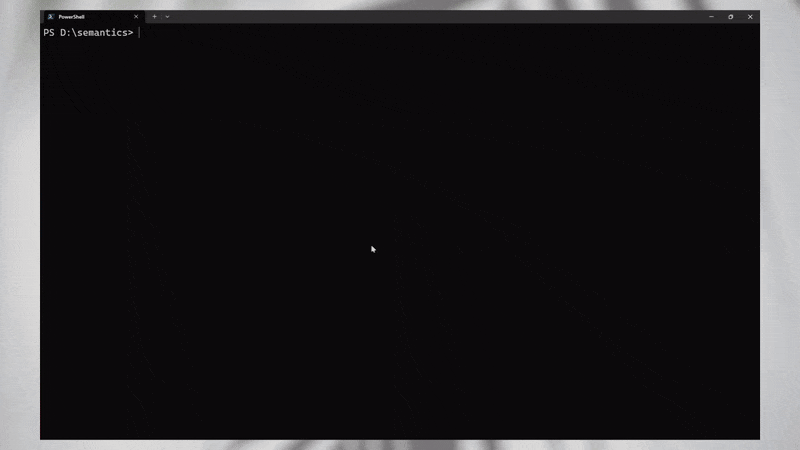

# Semantics CLI

A unified CLI toolkit for media intelligence, providing audio processing, video analysis, document extraction, and web research capabilities — all powered by state-of-the-art AI models running inside Docker.

Extract meaning, not just metadata. Composable AI operations designed for developers.



## Install

### Prerequisites

- [Docker](https://docs.docker.com/get-docker/) installed and running

### Quick Install

**Windows (PowerShell):**

```powershell
irm https://raw.githubusercontent.com/famda/semantics/main/docs/install.ps1 | iex
```

**Linux / macOS:**

```bash
curl -fsSL https://raw.githubusercontent.com/famda/semantics/main/docs/install.sh | bash
```

All processing runs inside a Docker container — no Python, CUDA, or model dependencies needed on your machine.

After installation, restart your terminal and verify:

```bash
semantics version
```

---

## Quick Start

### Audio: Transcribe and Identify Speakers

```bash
semantics audio -i interview.mp4 -o ./results -t -d
```

### Video: Extract Scenes and Detect Objects

```bash
semantics video -i video.mp4 -o ./results --from-segments -s -eo
```

### Research: Search and Download Web Content

```bash
semantics research -o ./results -s 'AI agents 2026' --download
```

### Docs: Extract Structure, Images, and Tables from Documents

```bash
semantics docs -i report.pdf -o ./results -s -im -t -m
```

### Update to the Latest Version

```bash
semantics update
```

> **How it works:** Each command transparently starts a Docker container, maps your local input/output paths into it, runs the AI pipeline, and writes results back to your machine. You never need to interact with Docker directly.

---

## Commands

### semantics-audio

Audio and speech processing toolkit.

| Flag | Description |
|------|-------------|
| `-i, --input PATH` | Input media file **(required)** |
| `-o, --output PATH` | Output folder path **(required)** |
| `-e, --enhance-audio` | Enhance audio quality |
| `-n, --denoise` | Denoise the audio file |
| `-s, --stem` | Enable source separation (extract vocals) |
| `-v, --vad` | Enable Voice Activity Detection |
| `-t, --transcribe` | Transcribe audio to text |
| `-te, --transcribe-experimental` | Ultra-fast transcription with CTC alignment |
| `-d, --diarize` | Enable speaker diarization |
| `-ctc, --ctc-align` | Enable CTC forced alignment (requires `-t` and `-d`) |
| `-c, --classify` | Enable audio classification |
| `-ct, --classify-timeline` | Enable timeline audio classification |
| `-em, --emotion` | Enable emotion recognition (requires `-t` or `-ctc`) |
| `-se, --scene` | Enable scene/chapter detection (requires `-t` or `-ctc`) |
| `-ner, --named-entities` | Extract named entities from transcript (requires `-t` or `-ctc`) |
| `--debug` | Enable verbose debug logging |
| `--plain` | Disable rich formatting, use plain text output |
| `--config PATH` | Path to YAML config file |
| `-h, --help` | Show help message |

**Example:**

```bash
semantics audio -i recording.mp4 -o ./audio_results -n -s -t -d -em
```

---

### semantics-video

Video analysis and object detection toolkit.

| Flag | Description |
|------|-------------|
| `-i, --input PATH` | Input video file or YouTube URL **(required)** |
| `-o, --output PATH` | Output folder path **(required)** |
| `--from-frames` | Analyze from extracted video frames |
| `--from-clustering` | Analyze from keyframe/clustering on frames |
| `--from-segments` | Analyze from keyframes/segments **(one of these three is required)** |
| `-t, --tiles` | Enable video tiling |
| `-eo, --extract-objects` | Extract objects from the video |
| `-co, --cluster-objects` | Cluster the extracted objects |
| `-classes, --object-classes TEXT` | Object classes to extract (default: `person`) |
| `--save-annotations` | Persist detection crops and masks to disk |
| `-c, --captions` | Extract captions from the video |
| `-s, --scenes` | Enable scene extraction |
| `-ocr, --extract-text` | Enable text extraction (OCR) |
| `-cl, --classify` | Enable frame classification |
| `-ner, --named-entities` | Extract named entities from captions (requires `-c`) |
| `-a, --actions` | Recognize human actions in the video |
| `--download-resolution INT` | Max video height when downloading from URL |
| `--save-frames` | Save extracted frames to disk |
| `-fps, --frames-per-second INT` | Frames per second to analyze (default: 1) |
| `--debug` | Enable verbose debug logging |
| `--plain` | Disable rich formatting, use plain text output |
| `--config PATH` | Path to YAML config file |
| `-h, --help` | Show help message |

> **Note:** You must specify one of `--from-frames`, `--from-clustering`, or `--from-segments`.

**Example:**

```bash
semantics video -i video.mp4 -o ./video_results --from-segments -s -eo -c
```

---

### semantics-research

Web research and content extraction toolkit.

| Flag | Description |
|------|-------------|
| `-i, --input PATH` | Input file for processing |
| `-o, --output PATH` | Output folder path **(required)** |
| `-s, --search TEXT` | Text query to research |
| `--search-limit INT` | Maximum number of web/video results |
| `--download` | Download/crawl search results (use with `-s`) |
| `--download-url URL` | Specific URL to crawl (alternative to `--download`) |
| `--download-deep` | Enable BFS deep crawling |
| `--download-max-depth INT` | Maximum traversal depth when deep crawling |
| `--download-max-pages INT` | Page budget when deep crawling |
| `--download-include-external` | Allow deep crawl to follow external domains |
| `--download-word-threshold INT` | Minimum word count for page materialization |
| `--structured` | Extract structured content from crawled pages |
| `--debug` | Enable verbose debug logging |
| `--plain` | Disable rich formatting, use plain text output |
| `--config PATH` | Path to YAML config file |
| `-h, --help` | Show help message |

> **Note:** You must specify one of `-s` (search query), `--download-url`, or `-i` (input file).

**Example:**

```bash
semantics research -o ./research_results -s 'machine learning trends' --download --structured
```

---

### semantics-docs

Document processing and extraction toolkit.

| Flag | Description |
|------|-------------|
| `-i, --input PATH` | Input document file (PDF, DOCX, PPTX, TXT, MD) **(required)** |
| `-o, --output PATH` | Output folder path **(required)** |
| `-s, --structured` | Extract structured content from the document |
| `-im, --images` | Extract images from the document (PDF only) |
| `-t, --tables` | Extract tables to CSV/HTML files |
| `-m, --markdown` | Convert document to Markdown format |
| `--debug` | Enable verbose debug logging |
| `--plain` | Disable rich formatting, use plain text output |
| `--config PATH` | Path to YAML config file |
| `-h, --help` | Show help message |

**Example:**

```bash
semantics docs -i report.pdf -o ./docs_results -s -im -t -m
```

---

## Utility Commands

### `semantics update`

Pull the latest version of the CLI container image:

```bash
semantics update
```

### `semantics version`

Show version and image information:

```bash
semantics version
```

### `semantics help`

Show available commands and usage:

```bash
semantics help
```

---

## Common Workflows

### Interview Transcription

Denoise, separate vocals, transcribe, identify speakers, and detect emotions:

```bash
semantics audio -i interview.mp4 -o ./results/interview -n -s -t -d -em
```

### Full Audio Analysis Pipeline

Run all audio modules including classification and scene detection:

```bash
semantics audio -i video.mp4 -o ./results/full_audio -e -n -s -v -t -d -ctc -c -em -se
```

### Video Scene Analysis with Object Tracking

Extract scenes, detect objects (people by default), and save annotations:

```bash
semantics video -i video.mp4 -o ./results/scenes --from-segments -s -eo --save-annotations
```

### Web Research Pipeline

Search for a topic, download results, and extract structured content:

```bash
semantics research -o ./results/research -s 'machine learning trends' --search-limit 10 --download --structured
```

### Deep Crawl a Website

Crawl a specific URL with depth and page limits:

```bash
semantics research -o ./results/crawl --download-url 'https://example.com/docs' --download-deep --download-max-depth 3 --download-max-pages 50 --structured
```

### Full Document Extraction

Extract structured content, images, tables, and Markdown from a PDF:

```bash
semantics docs -i report.pdf -o ./results/docs -s -im -t -m
```

### Using a Config File

Override default model parameters and settings via YAML:

```bash
semantics audio -i recording.mp4 -o ./results/custom --config my-config.yml -t -d
```

---

## Configuration

Each CLI supports YAML configuration files for advanced settings:

```bash
semantics audio -i input.mp4 -o ./output --config my_config.yml -t -d
```

Default configuration examples are located in the repository at:

- `configs/audio-config.yml`
- `configs/video-config.yml`
- `configs/research-config.yml`
- `configs/docs-config.yml`

---

## Output Structure

All CLIs write results to the specified output folder with organized subdirectories and structured data:

```
output_folder/
├── transcripts/        # Audio transcriptions (JSON, SRT, VTT)
├── diarization/        # Speaker diarization results
├── emotions/           # Emotion recognition data
├── entities/           # Named entity recognition results
├── scenes/             # Scene/chapter detection
├── objects/            # Detected objects and crops
├── frames/             # Extracted video frames
└── ...
```

---

## Uninstall

### Linux / macOS

```bash
rm -rf ~/.semantics
```

Then remove the PATH entry from your shell config (`~/.bashrc`, `~/.zshrc`, etc.):

```bash
# Delete the line containing "/.semantics/bin" from your shell config
```

### Windows (PowerShell)

```powershell
Remove-Item -Recurse -Force "$env:LOCALAPPDATA\semantics"

# Remove from PATH
$p = [Environment]::GetEnvironmentVariable("Path", "User") -split ";" |
     Where-Object { $_ -notlike "*\semantics" }
[Environment]::SetEnvironmentVariable("Path", ($p -join ";"), "User")
```

---

## Advanced: Docker Compose

For development or persistent containers, you can use Docker Compose directly.

### 1. Create a Docker Compose File

Create a `docker-compose.yml` file in your project directory:

```yaml
x-cuda-support: &cuda-support
  deploy:
    resources:
      reservations:
        devices:
          - driver: nvidia
            count: all
            capabilities: [gpu, utility, compute, video]

x-volumes: &volumes
  volumes:
    - ./.data/semantics:/workspaces

x-environment: &environment
  environment:
    - TF_ENABLE_ONEDNN_OPTS=0
    - TF_DISABLE_XLA=1
    - NVIDIA_DRIVER_CAPABILITIES=compute,utility,video

services:
  semantics-audio:
    image: famda/semantics:audio-latest
    tty: true
    stdin_open: true
    <<: [*environment, *volumes, *cuda-support]

  semantics-video:
    image: famda/semantics:video-latest
    tty: true
    stdin_open: true
    <<: [*environment, *volumes, *cuda-support]

  semantics-research:
    image: famda/semantics:research-latest
    tty: true
    stdin_open: true
    <<: [*environment, *volumes, *cuda-support]

  semantics-docs:
    image: famda/semantics:docs-latest
    tty: true
    stdin_open: true
    <<: [*environment, *volumes, *cuda-support]
```

### 2. Setup Your Workspace

```bash
# Create directories for input files and results
mkdir -p .data/semantics/assets
mkdir -p .data/semantics/results

# Copy your media files to the assets folder
cp your_video.mp4 .data/semantics/assets/
```

### 3. Start the Workers

```bash
docker compose up -d
```

### 4. Run Commands

```bash
docker compose exec semantics-audio bash -lc "semantics-audio -i /workspaces/assets/video.mp4 -o /workspaces/results/audio_test -t -d"
docker compose exec semantics-video bash -lc "semantics-video -i /workspaces/assets/video.mp4 -o /workspaces/results/video_test --from-segments -s -eo"
docker compose exec semantics-research bash -lc "semantics-research -o /workspaces/results/research_test -s 'AI trends' --download"
docker compose exec semantics-docs bash -lc "semantics-docs -i /workspaces/assets/document.pdf -o /workspaces/results/docs_test -s -im -t -m"
```

### 5. Stop Workers

```bash
docker compose down
```

---

## Advanced: Standalone Docker Run

Run containers directly without Docker Compose:

### Audio Processing

```bash
docker run --rm --gpus all \
  -v "$(pwd)/assets:/workspaces/input:ro" \
  -v "$(pwd)/results:/workspaces/output" \
  famda/semantics:audio-latest \
  -lc "semantics-audio -i /workspaces/input/sample.mp4 -o /workspaces/output -t -d"
```

### Video Analysis

```bash
docker run --rm --gpus all \
  -v "$(pwd)/assets:/workspaces/input:ro" \
  -v "$(pwd)/results:/workspaces/output" \
  famda/semantics:video-latest \
  -lc "semantics-video -i /workspaces/input/sample.mp4 -o /workspaces/output --from-segments -s -eo"
```

### Web Research

```bash
docker run --rm \
  -v "$(pwd)/results:/workspaces/output" \
  famda/semantics:research-latest \
  -lc "semantics-research -o /workspaces/output -s 'AI trends' --download"
```

### Document Processing

```bash
docker run --rm \
  -v "$(pwd)/assets:/workspaces/input:ro" \
  -v "$(pwd)/results:/workspaces/output" \
  famda/semantics:docs-latest \
  -lc "semantics-docs -i /workspaces/input/document.pdf -o /workspaces/output -s -im -t -m"
```

---

## Available Docker Images

Pre-built images are available on Docker Hub:

| Tag Pattern | Description |
|-------------|-------------|
| `cli-latest` | All four CLIs in one image (used by the installer) |
| `audio-latest`, `video-latest`, `research-latest`, `docs-latest` | Single-CLI images |
| `audio-<sha>`, `video-<sha>`, `research-<sha>`, `docs-<sha>`, `cli-<sha>` | Specific commit builds |

```bash
docker pull famda/semantics:cli-latest
docker pull famda/semantics:audio-latest
```

---

## License

MIT
